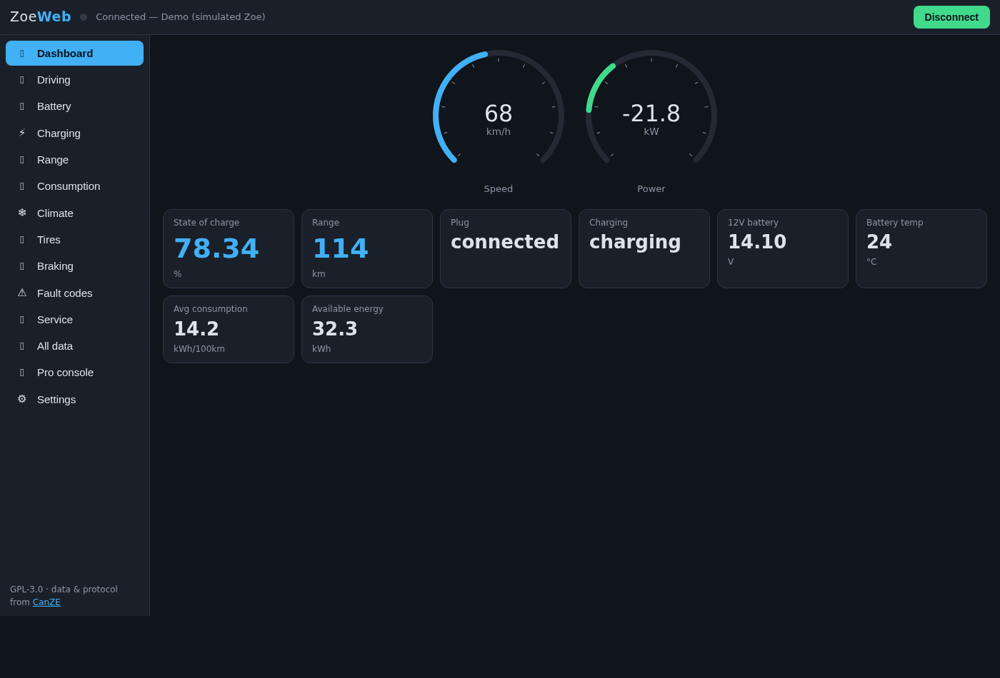
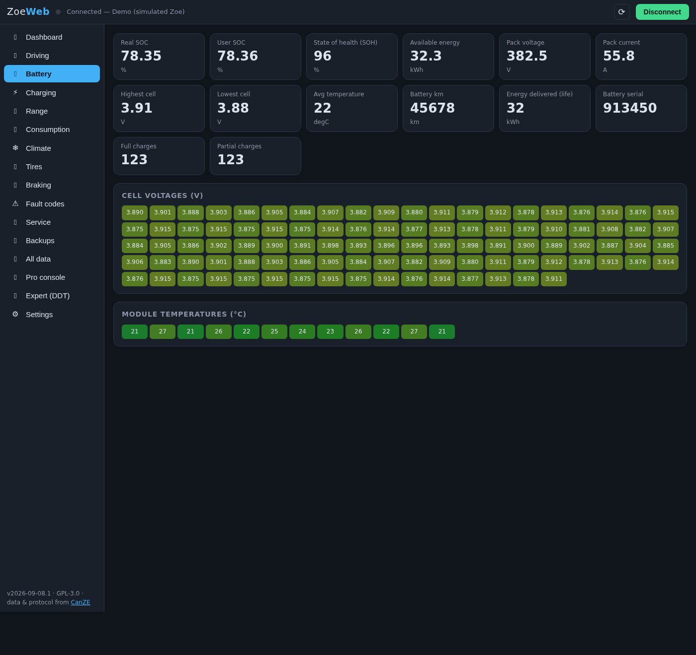
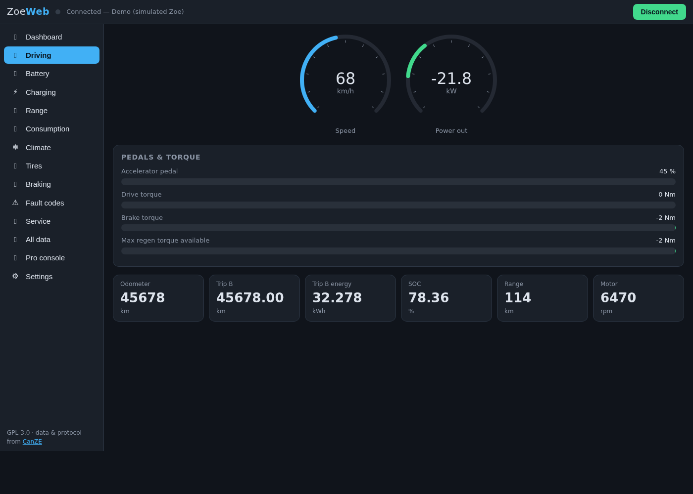
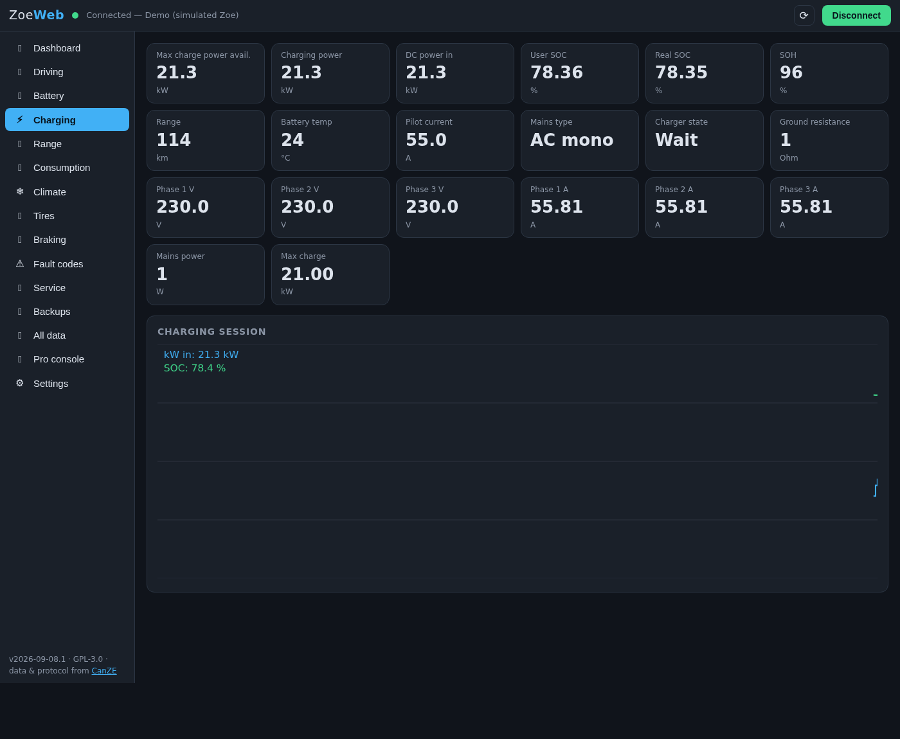
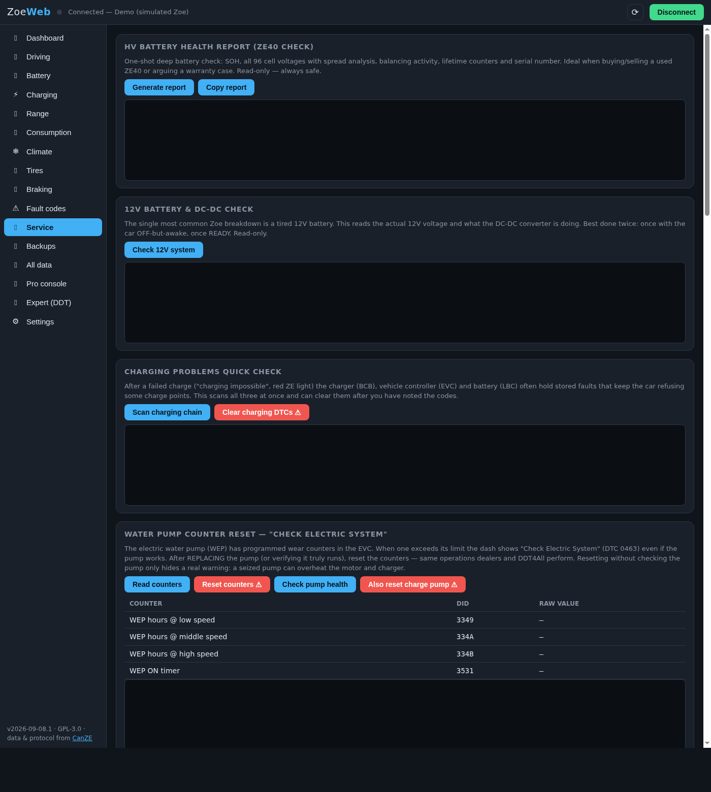

# ZoeWeb — CanZE for the browser

**▶ Try it live: <https://pjpetrov.github.io/zoeweb/>** — demo mode works in any
browser, no car needed; with an ELM327 dongle it connects to a real one.

A web clone of [CanZE](https://github.com/fesch/CanZE) ("take a closer look at your ZE car"):
live diagnostics for Renault ZE electric cars (Zoe Ph1, Zoe Ph2/ZE50, Twingo III Electric, Twizy)
running entirely in the browser — no app install, served as a static website.

It talks to a cheap ELM327-compatible OBD2 dongle over **Web Serial** (USB, and
macOS-paired Bluetooth), **Web Bluetooth** (BLE dongles), or a bundled **WebSocket
bridge** for classic-SPP dongles — and reuses CanZE's actual vehicle databases
(~40 000 field definitions, ECU maps, and fault-code catalogs) so it can decode
the same data the Android app can.

## Screenshots

| Dashboard | Battery (96-cell heatmap) |
|---|---|
|  |  |

| Driving | Charging |
|---|---|
|  |  |



*All screenshots taken in the built-in demo mode (simulated Zoe) — no car needed to try it.*

## Screens (CanZE feature parity)

| Screen | What it shows |
|---|---|
| Dashboard | speed & power gauges, SOC, range, plug/charge state, 12V battery, temps |
| Driving | speed, pedal, drive/brake torque bars, odometer, trip meter |
| Battery | real/user SOC, SOH, pack V/A, **96 cell voltages heatmap**, module temperatures heatmap, battery serial, charge counters |
| Charging | charger state, pilot current, phase voltages/currents, ground resistance, DC power, live charging graph |
| Range | range estimate, available energy, avg/best/worst consumption |
| Consumption | live power & speed plot, instant consumption |
| Climate | climate power, refrigerant pressure, loop modes, battery conditioning |
| Tires | TPMS pressures and states per wheel |
| Braking | brake blending: driver request vs regen vs friction |
| Fault codes | read DTCs per ECU or scan the whole car, decoded with CanZE's DTC catalogs; separates real faults from "self-test not yet run" entries |
| All data | browse and live-poll *every* known field of any ECU, with search |

## Beyond CanZE — Service procedures

The **Service** screen offers guided procedures for the Zoe Ph1 / ZE40, in the
order they appear in the app:

- **HV battery health report** — SOH, all 96 cell voltages with spread analysis,
  balancing activity, lifetime kWh/km counters, serial number; copy-to-clipboard
  report for used-car checks and warranty arguments (read-only)
- **12V battery & DC-DC check** — actual 12V voltage and DC-DC converter output,
  with plain-language verdicts (the most common Zoe breakdown; read-only)
- **Charging problems quick check** — scans BCB-OBC + EVC + LBC for stored faults
  after a failed charge, with an optional guarded clear of all three
- **Water pump counter reset** ("Check Electric System" / DTC 0463) — reads the four
  EVC wear counters (`3349`/`334A`/`334B`/`3531`), then after typed confirmation
  zeroes them via `2E` writes, clears the DTC and verifies (per cedricp/ddtplugins PR #8)
- **Odometer / mileage check** — compares the three independent mileage counters
  (EVC, cluster, battery) plus the km/miles setting, and diagnoses why a dash may
  show the wrong number: unit mismatch, lagging cluster, donor cluster (read-only)
- **TPMS reference pressures** — the per-wheel pressure/temperature references the
  cluster has learned (read-only)
- **Cluster preferences** — the classic DDT4All cluster tweaks via the verified
  `Config Generale` identifiers: clock (12/24 h), outside temperature, km/miles,
  bar/PSI, language, indicator sound, overspeed warning, rear wiper on reverse.
  Reads current values first; every write is verified by read-back.
- **Cluster feature flags** — TPMS on/off (the winter-wheels tweak), cruise
  control/limiter, park assist, climate, heated seats, TCU, auto headlights,
  navigation presence.
- **Android Auto on R-Link** — guided procedure: scans for the R-Link, reads the
  ADAS configuration (`6C1C`) and writes the community-known enable values, with
  read-back verification and rollback. Requires the rewired OBD cable (ELM pin
  6 → car pin 13, pin 14 → car pin 12: R-Link lives on the multimedia CAN) and
  up-to-date R-Link firmware.
- **ECU identification report** — software/version numbers of every reachable ECU,
  copyable; snapshot before a dealer visit, compare after.

Body-computer (BCM) tweaks from the forums — auto door locking, DRL behaviour,
mirror folding — are deliberately NOT included: the BCM's configuration layout
differs between its software versions and no verified per-version byte map
exists, so a hardcoded write could misconfigure the wrong car. For those, use
DDT4All with the definition file (XML) matching your exact BCM.

## Beyond CanZE — the Pro console

CanZE is deliberately read-only. ZoeWeb adds write capabilities (use responsibly,
on your own car only):

- **Clear fault codes** per ECU (UDS service `14 FFFFFF`), with confirmation
- **Diagnostic session control** (default / extended, `10 C0` / `10 03`)
- **ReadDataByIdentifier** browser (service `22`)
- **WriteDataByIdentifier** (service `2E`) — guarded: reads the current value first
  (logged for rollback), then requires typing the ECU name to confirm
- **RoutineControl** (service `31`) for actuator tests and resets
- **Raw UDS console** with a full request/response traffic log

⚠️ **Writes and routines are executed exactly as you type them.** A wrong write can
misconfigure or permanently damage an ECU. Know your Renault DDT parameter
documentation before writing anything, keep the car stationary, and never use
this while driving. You alone are responsible for what you send to your car.

## Running it

**Easiest (desktop)**: grab `zoeweb.html` from the [latest release](../../releases/latest) —
a single self-contained file (app + all vehicle databases). Open it in Chrome or
Edge and it just runs: demo mode instantly, real cars via a USB or Bluetooth-LE
ELM327 dongle. Build it yourself with `npm install && npm run build` → `dist/zoeweb.html`.
Note: this file is for computers — phone file viewers (iOS Files preview in
particular) render it without JavaScript, so on phones use the hosted URL instead.

Otherwise it is a static site — any web server works:

```bash
cd zoe
python3 -m http.server 8080     # then open http://localhost:8080
```

For real hardware access the page must be served from **`https://` or
`http://localhost`** (browser security requirement for Web Serial / Web Bluetooth).
Any static host (nginx, GitHub Pages, Netlify…) is fine for https.

### Hardware & browser support

| Connection | Works in | Notes |
|---|---|---|
| Demo (simulated Zoe) | every browser | no hardware needed, full UI works |
| USB / serial ELM327 | Chrome & Edge, desktop | pick baud rate in Settings (38400 for older clones) |
| Bluetooth **LE** ELM327 (vLinker, vGate, …) | Chrome desktop & **Android** | probes the common GATT profiles (FFF0/FFE0/…) |

**Classic Bluetooth (SPP) dongles — what most people used with CanZE — are not
directly reachable from any browser.** Two ways to use one anyway:

- **macOS**: pair the dongle in System Settings → Bluetooth (PIN 1234/0000).
  macOS creates a virtual serial port (`/dev/cu.<name>`, e.g. `cu.OBDII`) which
  shows up in the Web Serial picker — use the USB/serial option (any baud rate)
  and pick the port named after the dongle, never `Bluetooth-Incoming-Port`.
  Known macOS quirk: after the link drops (dongle sleep, car locked), macOS often
  refuses to reconnect — "Forget This Device" and re-pair brings it back.
  The dongles themselves sleep after a few idle minutes; replug to wake them.
- **Linux/Windows**: run the included relay, `python3 tools/spp-bridge.py <dongle-MAC>`
  (Linux talks RFCOMM directly; you can also pass a serial device path).
  Then pick "Classic Bluetooth via PC bridge" in Settings. The bridge listens on
  `ws://localhost:8472`; `--loopback` runs a self-test without hardware.

Otherwise use a BLE dongle (Vgate iCar Pro BLE 4.0, vLinker MC+, OBDLink CX) or USB.

### iPhone / iPad (iOS)

Apple forbids every iOS browser — Chrome and Safari included — from accessing
Bluetooth or serial ports, so the connection options are greyed out there and no
setting can change that. The working recipe on iOS is:

1. Use a **Bluetooth LE dongle** (e.g. Vgate iCar Pro **BLE 4.0** — the variant
   whose box says "for iOS & Android"; classic-Bluetooth and WiFi dongles cannot
   work at all).
2. Install the free **Bluefy** browser from the App Store ("Bluefy – Web BLE
   Browser") — a browser that implements Web Bluetooth on iOS itself.
3. Open the **hosted** ZoeWeb URL in Bluefy (GitHub Pages or any https host —
   not the downloaded single file), go to Settings → connection
   **"Bluetooth LE ELM327"**, press **Connect** and pick the dongle
   (Vgate advertises as "IOS-Vlink"). No OS-level pairing is needed.

Plain Safari/Chrome on iOS can still run the **demo mode**, and "Add to Home
Screen" works for that — but a real car connection on iOS only works inside
Bluefy (or a native wrapper app built with Capacitor + a BLE plugin, which
requires an Apple developer account to distribute).

Plug the dongle into the OBD2 port, switch the ignition on, then press
**Connect**. On connect the app **auto-detects which car it is** (Zoe Ph1 /
Zoe Ph2 / Twingo III / Twizy) by probing each platform's signature ECUs and
loads the matching database — no manual selection needed. You can turn this off,
force a model, or re-run detection ("Detect car now") in Settings. Add
`?autoconnect` to the URL to connect automatically on load.

## How it works

```
assets/<CAR>/*.csv        CanZE's databases, verbatim (ECUs, fields, DTCs, tests)
js/core/fields.js         CSV parser + bit-level frame decoder ((raw-offset)*resolution)
js/core/ecus.js           ECU registry, per-car database loader
js/core/poller.js         interval scheduler; groups fields into frame requests
js/core/uds.js            DTC read/clear, sessions, DID read/write, routines
js/core/virtual.js        computed fields (DC power, instant consumption, …)
js/device/elm327.js       ELM327 driver: init, free frames (atma), ISO-TP framing
js/core/embedded.js       asset store for the single-file build (gzip in the HTML)
js/device/transport.js    Web Serial, Web Bluetooth (BLE) and WebSocket transports
js/device/demo.js         a virtual ELM327+Zoe synthesized from the field database
js/screens/*, js/ui/*     the screens and widgets (Service, Pro console, …)
tools/spp-bridge.py       relay for classic Bluetooth (SPP) dongles
build/build.mjs           single-file build (esbuild bundle + embedded databases)
```

The protocol flow is a direct port of CanZE's `ELM327.java`: `atcaf0` manual
ISO-TP framing, `atfcsm1` flow control, 11-bit (`atsp6`) and 29-bit (`atsp7` +
`atcp`, Zoe Ph2 gateway) addressing, multi-frame reassembly.

## License & credits

GPL-3.0, like CanZE. The vehicle databases in `assets/` and the protocol design
are the work of the [CanZE team](https://canze.fisch.lu) — all credit to them.
This project is not affiliated with Renault. Use at your own risk.
